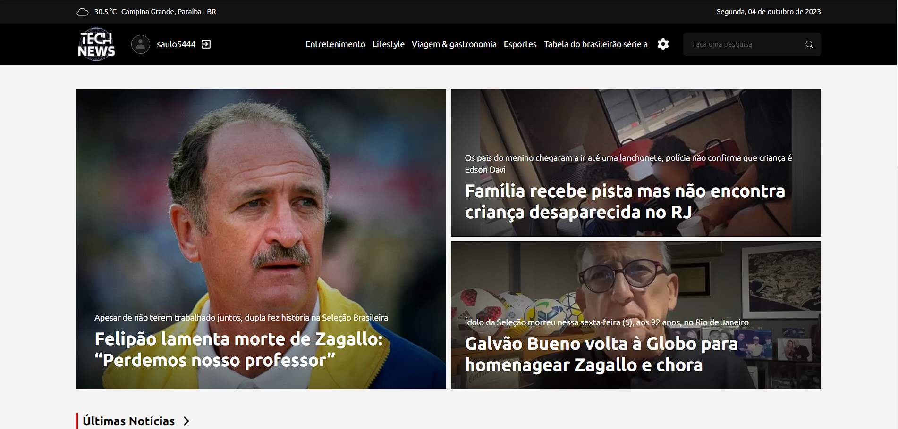
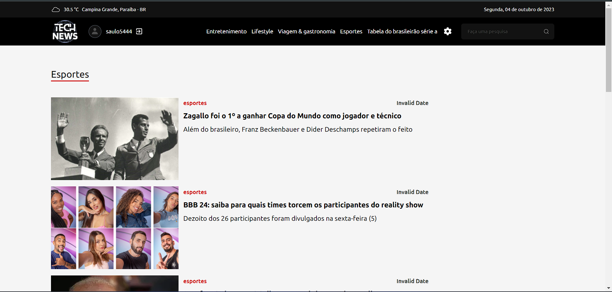
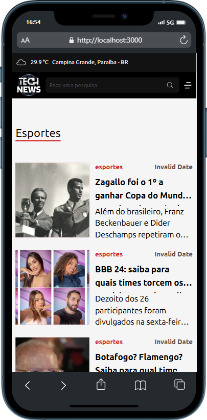

    

------------------------------------
## Índice

- [Índice](#índice)
- [💻 Sobre ](#-sobre-)
- [🚀 Preview ](#-preview-)
- [⚙️ Funcionalidades ](#️-funcionalidades-)
- [🎨 Layout ](#-layout-)
- [🤖 Tecnologias ](#-tecnologias-)
- [👨 Autor ](#-autor-)
- [📜 Licença ](#-licença-)

------------------------------------

## 💻 Sobre 
Esse site de notícias recupera e exibe notícias da CNN
 

------------------------------------

## 🚀 Preview 

-> https://technews-saulofelipe.vercel.app/

------------------------------------

## ⚙️ Funcionalidades 
1. ✅ Criar notícia
2. ✅ Importar notícias 
3. ✅ Importar Categorias 

------------------------------------

## 🎨 Layout 

*O Layout completo do site está disponível <a href="https://technews-saulofelipe.vercel.app/">aqui</a>.

    
    

## 🤖 Tecnologias 

Nesta plataforma de noticias, foram utilizadas as tecnologias: 

* HTML5 
* CSS3 
* Typescript 
* Nextjs 
* PostgreSQL 
* websocket 
* NestJs 
* Tailwind 

------------------------------------

## 👨 Autor 

➡️ Desenvolvido por <strong>eu</strong> mesmo 🧑‍💻.

------------------------------------

## 📜 Licença 

Todos os direitos reservados ©Copyright - Saulo Felipe

